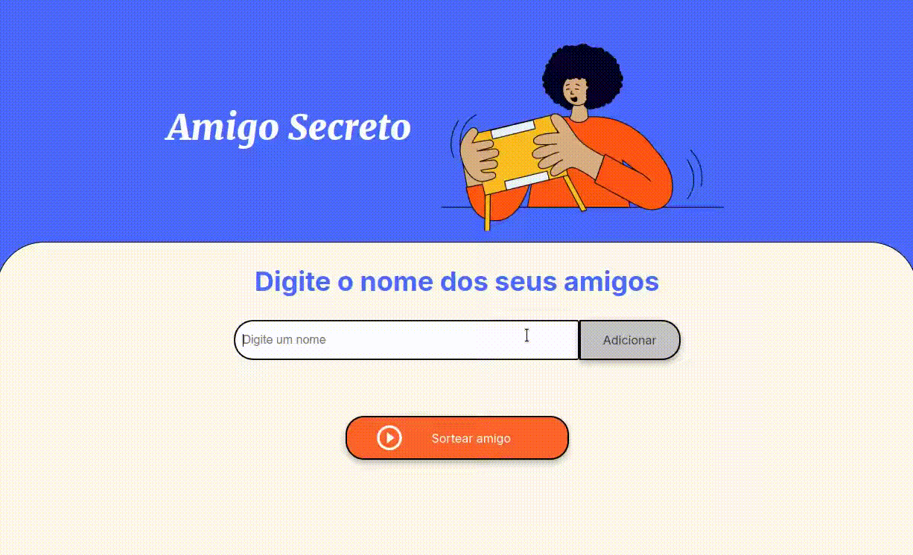

# Amigo Secreto 🎁

## 📖 Sobre

Este projeto é uma aplicação web interativa desenvolvida para facilitar e tornar mais divertida a experiência de realizar sorteios de amigo secreto. Com uma interface simples e intuitiva, você pode adicionar participantes, realizar sorteios aleatórios e visualizar os resultados de forma dinâmica.

---

## 🛠 Tecnologias Utilizadas

- **HTML5**
- **CSS3**
- **JavaScript**

---

## 🚀 Funcionalidades

- **Adicionar Nomes**: Insira os nomes dos amigos na lista de participantes.
- **Exibição Dinâmica**: Visualize os nomes adicionados em tempo real.
- **Sorteio Aleatório**: Sorteie um nome de forma aleatória entre os participantes.
- **Exibição do Sorteado**: Mostre quem foi o amigo sorteado.

---

## 📋 Como Usar

1. Acesse a aplicação pelo link: [Amigo Secreto Web App](https://gutoobrandao.github.io/amigo-secreto-one) 🔗
2. **Adicionar Amigos**: Digite o nome de um amigo no campo indicado e clique no botão "Adicionar".
3. Repita o passo anterior para incluir todos os participantes na lista.
4. **Sortear Amigo**: Clique no botão "Sortear Amigo" para realizar o sorteio.
5. O nome sorteado será exibido na tela!

---

## 🔮 Próximos Passos

- **Exclusão Automática**: Remover o nome sorteado da lista automaticamente.
- **Sorteio Completo**: Adicionar a funcionalidade de sortear todos os participantes de uma vez.
- **Melhorias na Interface**: Refinar o design para maior usabilidade e apelo visual.

---

## 🤝 Contribuições

Contribuições são muito bem-vindas! Para colaborar:

1. Faça um fork do projeto.
2. Crie uma nova branch para sua funcionalidade: `git checkout -b minha-nova-feature`.
3. Envie suas alterações via pull request.
